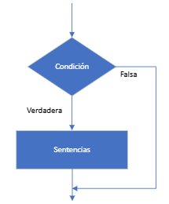
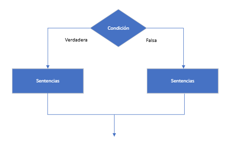
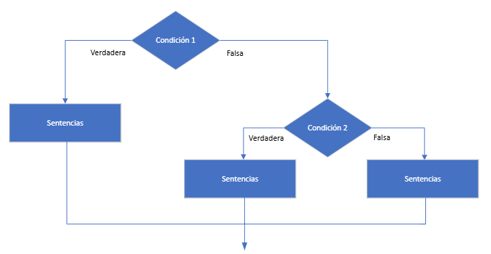
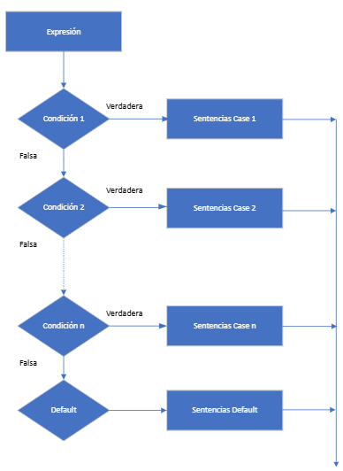
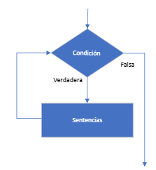
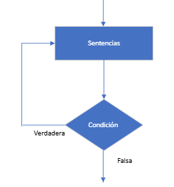
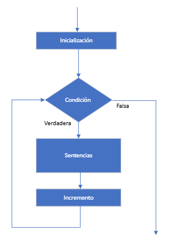
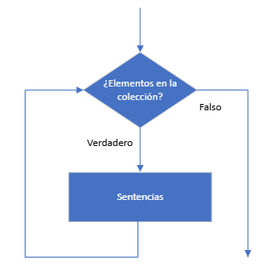

                                     

<br>
<br>

# Tema 3. Sentencias de Control de Flujo

[*1.	Introducción*](#_apartado1)

[*2.	Sentencias Condicionales*](#_apartado2)

[*3.	Sentencias de Repetición*](#_apartado3)

[*4.	Sentencias de salto*](#_apartado4)


<br>
<br>

# <a name="_apartado1"></a>1. Introducción.

El orden en que se ejecutan las instrucciones de un programa se conoce como **flujo de control**. 

En los programas vistos en el tema anterior, dicho flujo era **secuencial**, es decir, las instrucciones se ejecutaban una tras otra en el mismo orden en que aparecían dentro de los subprogramas.

Sin embargo, este flujo secuencial resulta limitado para resolver problemas más complejos. En muchos casos, es necesario que un grupo de instrucciones se ejecute **repetidamente**, o bien que se ejecute **solo si se cumple una determinada condición**.

Antes de estudiar las sentencias de control de flujo en C#, es importante recordar el concepto de **expresiones condicionales**. Estas expresiones se evalúan como **verdaderas (`true`)** o **falsas (`false`)**, y permiten tomar decisiones dentro del programa.

Para construir expresiones condicionales, se pueden utilizar:

- Operadores aritméticos: `+, -, *, /, %`

- Operadores de comparación: `<, >, <=, >=, !=, ==`

- Operadores lógicos: `!, ||, &&`
  
El resultado de estas expresiones debe ser un valor **booleano**, que servirá como base para controlar el flujo del programa.

<br>
<br>

# <a name="_apartado2"></a>2. Sentencias Condicionales o de Selección.

Estas sentencias permiten ejecutar diferentes bloques de código según el resultado de una o varias condiciones.

<br>

## Sentencia if 

La sentencia `if` evalúa una condición lógica. Si el resultado es `true`, se ejecuta la sentencia o sentencias asociadas. Si es `false`, dichas sentencias no se ejecutan y el programa continúa con la siguiente instrucción.



 
**Sintaxis:**

```csharp
if (condición)
{
	//Instrucciones a ejecutar si la condición es true 
}
```

**Ejemplo:**

```csharp
if (edad >= 18)
{
	Console.WriteLine("Mayor de edad");
}
```

En este ejemplo, el mensaje se mostrará solo si la variable edad es mayor o igual a 18.

<br>

## Sentencia if … else

La sentencia `if...else` permite ejecutar uno de dos bloques de código, dependiendo del resultado de una condición booleana. Si la condición se evalúa como `true`, se ejecuta el bloque del `if`, en caso contrario, se ejecuta el bloque del `else`.



**Sintaxis:**

```csharp
if (condición)
{
	// Instrucciones a ejecutar si la condición es true
}
else
{
	// Instrucciones a ejecutar si la condición es false
}
```

**Ejemplo:**

```csharp
if (edad >= 18)
{
	Console.WriteLine("Mayor de edad");
}
else
{
	Console.WriteLine("Menor de edad");
}
```

En este ejemplo, el programa evalúa si la variable edad es mayor o igual a 18. Si lo es, muestra el mensaje "Mayor de edad"; de lo contrario, muestra "Menor de edad".

<br>

## Expresión condicional ternaria

Cuando cada rama del if y del else contiene **una única instrucción**, se puede utilizar una **expresión condicional ternaria** para simplificar el código. Esta expresión evalúa una condición y devuelve uno de dos valores según el resultado.

**Sintaxis:**

```csharp
condición ? valor_si_true : valor_si_false;
```

**Ejemplo:**

```csharp
string resultado = (edad >= 18) ? "Mayor de edad" : "Menor de edad";
 
Console.WriteLine(resultado);	//Imprime "Menor de edad"
```

Este código es equivalente al ejemplo anterior, pero más compacto y legible cuando se trata de asignar valores simples en función de una condición.

<br>

## Sentencias if anidadas (Selección múltiple)

A veces, una sola condición no es suficiente para tomar una decisión en un programa. 

En esos casos, podemos utilizar sentencias **if anidadas** para evaluar varias condiciones de forma secuencial. Esto se logra combinando `if`, `else if` y `else`, lo que permite ejecutar distintos bloques de código según el caso que se cumpla.



**Sintaxis:**

```csharp
if (condición1)
{
	// Instrucciones si condición1 es true
}
else if (condición2)
{
	// Instrucciones si condición2 es true
}
else
{
	// Instrucciones si ninguna condición anterior se cumple
}
```

**Ejemplo:**

```csharp
int edad = 16;
 
if (edad >= 65)
{
	Console.WriteLine("Adulto mayor");
}
else if (edad >= 30)
{
	Console.WriteLine("Adulto");
}
else if (edad >= 13)
{
   Console.WriteLine("Adolescente");
}
else
{
   Console.WriteLine("Niño");
}
```

Este ejemplo evalúa la edad y muestra una categoría según el rango en el que se encuentre.

<br>

## Sentencia switch (Selección múltiple)

La instrucción switch permite ejecutar un bloque de código en función del valor de una expresión. Es una alternativa más clara a múltiples sentencias if cuando se desea comparar una misma variable con distintos valores.

La expresión evaluada **debe** ser de tipo **escalar** (como `int`, `char`, `string`, `enum`), pero **no puede** ser de tipo real (`float`, `double`, etc.). 

Si el valor coincide con alguno de los patrones definidos, se ejecuta el bloque correspondiente.



**Sintaxis:**

```csharp
switch (expresion)
{
	case patron1:
      //Sentencias
      break;

   case patron2:
      // Sentencias
      break;

   case patron3:
      // Sentencias 
      break;

   ...

   default:
      // Sentencias por defecto
		break;
}
```

**Ejemplo switch con tipo int:**
 

```csharp
int edad = 18;
 
switch (edad)
{
   case 0:
      Console.WriteLine("Recién nacido");
      break;
   case 13:
      Console.WriteLine("Inicio de la adolescencia");
      break;
   case 18:
      Console.WriteLine("Mayor de edad");
      break;
   case 65:
      Console.WriteLine("Edad de jubilación");
      break;
   default:
      Console.WriteLine("Edad sin hito específico");
      break;
}
```

Aquí, cada `case` usa un **patrón de constante** para comprobar si el resultado de una expresión es igual a una constante especificada.

**Agrupación de casos**

Cuando varios valores deben ejecutar el mismo bloque de código, se pueden agrupar sin repetir instrucciones. Solo el **último case del grupo debe incluir break**.

**Ejemplo switch con agrupación de casos:**

```csharp
int edad = 18;

switch (edad)
{
	case 0:
      Console.WriteLine("Recién nacido");
      break;

   case 13:
   case 14:
   case 15:
   case 16:
   case 17:
      Console.WriteLine("Adolescente");
      break;

   case 18:
   case 19:
   case 20:
      Console.WriteLine("Joven adulto");
		break;

   case 65:
   case 66:
   case 67:
      Console.WriteLine("Edad de jubilación");
      break;
      
   default:
      Console.WriteLine("Edad sin hito específico");
      break;
  }
```

**Uso de default**

El bloque `default` se ejecuta si ningún `case` coincide con el valor de la expresión. Si se omite, se produce un **error de compilación**.

**Importancia del break**

Cada bloque case debe terminar con una instrucción `break` para evitar que el programa continúe ejecutando los siguientes bloques. Si se omite, se produce un **error de compilación**.

**Ejemplo incorrecto (sin break):**

```csharp
int edad = 18;
 
switch (edad)
{
   case 18:
      Console.WriteLine("Mayor de edad");
   case 65:
      Console.WriteLine("Edad de jubilación");
      break;
   default:
      Console.WriteLine("Otro caso");
      break;
}
```

**Ejemplo switch con tipo enumerado:**

```csharp
enum NotasMusicales
{
   Do, Re, Mi, Fa, Sol, La, Si
}
  
static void Main(string[] args)
{
   double frecuencia;
   Console.Write("Introduce una nota musical (Do, Re, Mi, Fa, Sol, La, Si): ");
   string notaIngresada = Console.ReadLine();
  
   // Intentar convertir la entrada a un valor del enum, ignorando mayúsculas/minúsculas 
   if (Enum.TryParse(notaIngresada, ignoreCase: true, out NotasMusicales nota))
   {
      switch (nota)
      {
         case NotasMusicales.Do:
            frecuencia = 261.63; // Frecuencia de Do en Hz
            break;
         case NotasMusicales.Re:
            frecuencia = 293.66; // Frecuencia de Re en Hz
            break;

         case NotasMusicales.Mi:
            frecuencia = 329.63; // Frecuencia de Mi en Hz
            break;

         case NotasMusicales.Fa:
            frecuencia = 349.23; // Frecuencia de Fa en Hz
            break;

         case NotasMusicales.Sol:
            frecuencia = 392.00; // Frecuencia de Sol en Hz
            break;

         case NotasMusicales.La:
            frecuencia = 440.00; // Frecuencia de La en Hz
            break;

         case NotasMusicales.Si:
               frecuencia = 493.88; // Frecuencia de Si en Hz
               break;

         default:
            // Valor predeterminado si la nota no se reconoce
            frecuencia = 0.0; 
            break;
      }

      Console.WriteLine($"La frecuencia de {nota} es {frecuencia} Hz.");
   }
   else
   {
      Console.WriteLine("Nota no válida. Introduce una nota musical correcta.");
   }
}
```

**Importante: ¿Cuándo se ejecutaría la sentencia `default` en este código?**

La cláusula `default` dentro del `switch` solo se ejecutaría si el valor de nota no coincide con ninguno de los case definidos. Pero como nota es de tipo `NotasMusicales`, y el `TryParse` garantiza que solo se asigna un valor válido del `enum`, no hay forma de que `nota` tenga un valor "inválido" dentro del switch.

**Por eso, el `default` en este caso nunca se ejecuta.**


<br>
<br>

# <a name="_apartado3"></a>3. Sentencias de Repetición (Iteración)

<br>

## Repetición con condición: Sentencia while y do…while

Las sentencias `while` y `do…while` permiten ejecutar un bloque de código **mientras una condición sea verdadera**. 

Podemos utilizar estas instrucciones cuando **conocemos la condición** que debe cumplirse para **continuar la ejecución**, pero podemos no conocer el número de veces que se repite el ciclo.

La principal diferencia entre ambas estructuras es cuándo se evalúa la condición:

- En un bucle `while`, la condición se evalúa **antes** de ejecutar el bloque. Si la condición es falsa desde el inicio, el bloque no se ejecuta.
  
- En un bucle `do...while`, la condición se evalúa después de ejecutar el bloque, por lo que **el código se ejecuta al menos una vez**, independientemente de la condición inicial.

<br>

### Sentencia while 



**Sintaxis de while:**

```csharp
while (condición)
{
//Sentencias;
}
```
 
<br>

### Sentencia do…while 


 
 
**Sintaxis de do…while:**

```csharp	
do
{
//Sentencias;
} while (Condición);
```
 
**Ejemplo 1: Mostrar los números del 1 al 10 con sentencia while**

```csharp
int i = 1;
const int Numero = 10;

while (i <= Numero)
{
   Console.WriteLine(i);
   i++;
}
```

**Ejemplo 2: Mostrar los números del 1 al 10 con sentencia do...while**

```csharp
int i = 1;
const int Numero = 10;

do
{
Console.WriteLine(i);
       i++;
} while (i <= Numero);
```

<br>

## Repetición con contador: Sentencia for

La sentencia `for` permite ejecutar un bloque de código un número determinado de veces, que debe ser conocido de antemano. 

Para ello se utiliza una variable contador que controla el número de repeticiones.

**Sintaxis:**

```csharp
for (inicialización; condición; incremento)
{
   Sentencias;
}
```

El encabezado del bucle for se compone de tres partes:

- **Inicialización**: Aquí se declara e inicializa la variable contador.
  
- **Condición**: Se evalúa antes de cada iteración. **Mientras** la condición sea **cierta** se ejecutará el bucle.
  
- **Incremento**: Aquí se hará el incremento de la variable contador al finalizar la iteración.




**Ejemplo 1: Mostrar los números del 1 al 10 con sentencia for**

```csharp
const int Numero = 10;

for (int i = 1; i <= Numero; i++)
{
   Console.WriteLine(i);
}
```

En el ejemplo anterior:

1.	Se inicializa la variable `i` con el valor 1.

2.	Mientras se cumpla la condición `i <= Numero` se ejecutan repetidas veces las sentencias de dentro del `for`.

3.	`i++`. En cada paso del bucle se incrementa en 1 el valor de i.

**Ejemplo 2: Mostrar los números pares del 1 al 10 en una sola línea**

```csharp
const int Numero = 10;
 
string texto = "Numeros pares: ";
 
for (int i = 2; i <= Numero; i += 2)
{
   texto += i + ", ";
}      
Console.WriteLine(texto);
```

**Ejemplo 3: Mostrar los números del 10 al 1 (bucle descendente)**

```csharp
const int Numero = 10;

string texto = "Numeros del 10 al 1: ";

for (int i = Numero; i >= 1; i--)
{
   texto += i + ", ";
}      
Console.WriteLine(texto);
```

Atención al for de este último ejemplo: 

- La inicialización se hace con `i = Numero` ya que queremos empezar en 10.
- La condición ahora es `i >= 1`, ya que mientras i sea mayor o igual que 1 vamos a seguir en el bucle.
- Por último, el incremento ahora es realmente un decremento `i--`, ya que lo que hacemos es restar 1 en cada iteración a la variable i.

<br>

## Repetición basadas en colecciones: Sentencia foreach.

La sentencia `foreach` permite recorrer todos los elementos de una colección (como arrays, listas, enumerados, diccionarios, …) y ejecutar un bloque de código para cada uno de ellos. 

Es especialmente útil cuando no necesitamos modificar la colección ni controlar manualmente un índice.



Estos tipos de colecciones los veremos más detalladamente en los temas siguientes.
 
 	
**Sintaxis:**

```csharp
foreach (tipo variable in colección)
{
	//Sentencias a ejecutar con cada ele //mento 'variable' 
}
```

**Ejemplo 1: Recorrer una colección de tipo enumerado**

```csharp
enum DiasLaborables
{
   Lunes, Martes, Miercoles, Jueves, Viernes
}
 
 
static void Main(string[] args)
{
   string diasLaborables = "Días laborables de la semana:\n";
 
   foreach (DiasLaborables dia in Enum.GetValues(typeof(DiasLaborables)))
   {
      diasLaborables += dia.ToString() + "\n";
   }

   Console.WriteLine($"{diasLaborables} ");
}
```

**Resultado de la ejecución**
```
Días laborales de la semana:
Lunes
Martes
Miercoles
Jueves
Viernes
```

La sentencia foreach recorre automáticamente todos los elementos de la colección, sin necesidad de usar un contador ni preocuparse por los límites del índice.

**Ejemplo 2. Recorriendo un vector de elementos**

```csharp
static void Main(string[] args)
{
   string[] profesores = {"María", "Míchel", "David"};

   string texto = "Los profesores de Programación son: ";

   foreach (string nombre in profesores) 
   { 
      texto += nombre + ", ";
   }

   Console.WriteLine(texto);
}
```
Aunque todavía no hemos estudiado el tipo vector (lo haremos en el tema 6), en este ejemplo recorre cada uno de los elementos de dicho vector.

*Resultado de la ejecución*

```
Los profesores de Programación son: María, Míchel, David,
```

**Ejemplo 3: Recorrer una colección (lista) de números**

```csharp
static void Main(string[] args)
{

   List<int> numeros = new List<int> { 5, 3, 1, 6, 8 };

   foreach (int numero in numeros)
   {
      Console.Write($"{numero} ");
   }
}
```

*Resultado de la ejecución*
```
5 3 1 6 8
```

<br>
<br>

# <a name="_apartado4"></a>4. Sentencias de Salto

<br>

## Sentencia break.

Las **instrucciones de salto** (jump statements) son aquellas que alteran el flujo normal de ejecución de un programa, haciendo que el control "salte" a otra parte del código. 

La sentencia `break` se utiliza para **salir inmediatamente** del bloque de control en el que se encuentra. Puede aplicarse en bucles (`while`, `do...while`, `for`, `foreach`) y en estructuras switch. Al ejecutarse, transfiere el control a la **siguiente instrucción fuera del bloque**.

**Ejemplo 1: Uso de break para salir de un bucle while al encontrar un número par**        

```csharp
int numero, i = 0;
 
while (i < 10)
{
   Console.Write($"Número {i + 1}: ");
   numero = int.Parse(Console.ReadLine());
 
   if (numero % 2 == 0)
   {
      Console.WriteLine($"Número par encontrado: {numero}");
      break;
   }
   i++;
}
```
        
El mismo comportamiento puede lograrse sin utilizar sentencia `break`, mediante una variable booleana. Esta forma **puede mejorar la legibilidad del código** ya que la condición de salida se expresa directamente en la cabecera del bucle.

**Ejemplo 2: Uso de variable booleana, en lugar de break.**
    
```csharp
int numero, i = 0;
 
bool encontradoPar = false;
 
while (i < 10 && !encontradoPar)
{
   Console.Write($"Número {i + 1}: ");
   numero = int.Parse(Console.ReadLine());
 
   if (numero % 2 == 0)
   {
      Console.WriteLine($"Número par encontrado: {numero}");
      encontradoPar = true;
   }
   i++;
}
```
        
Usar break puede ser más directo en casos simples, mientras que el uso de una variable de control puede facilitar la comprensión del flujo lógico, especialmente en estructuras más complejas.

<br>

##	Sentencia return

La instrucción `return` se utiliza para **finalizar la ejecución del bloque de código actual** y devolver el control al punto desde donde se llamó. Aunque su uso principal es dentro de **funciones** (que se verán en el tema siguiente), también puede emplearse en el programa principal **para terminar su ejecución de forma anticipada**.

**Ejemplo: Uso de return para salir del programa**

```csharp
Console.Write("Introduce un número positivo: ");
int numero = int.Parse(Console.ReadLine());
 
if (numero < 0)
{
   Console.WriteLine("Número no válido.");
   return; // Fin del programa
}
 
Console.WriteLine($"Has introducido el número {numero}.");

